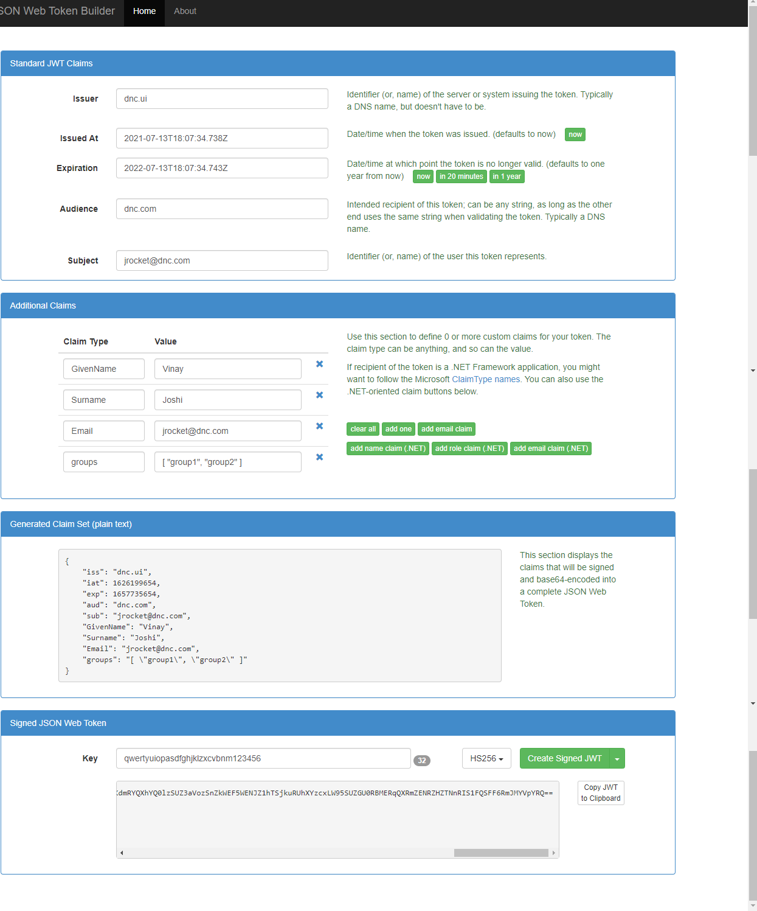

# dncapi

.Net Core API with Startup Template

# Packages

- `dotnet add package Swashbuckle.AspNetCore --version 5.6.3`
- `dotnet add package Microsoft.EntityFrameworkCore.SqlServer --version 5.0.2`

### tools use for token generation online.

http://jwtbuilder.jamiekurtz.com/

Following Post
https://www.c-sharpcorner.com/article/policy-based-role-based-authorization-in-asp-net-core/

https://www.c-sharpcorner.com/article/authentication-and-authorization-in-asp-net-core-web-api-with-json-web-tokens/

https://www.blogofpi.com/policy-based-authorization-in-asp-net-core/

### Please follow below Document to Register and SPA application either Angular with MSAL

https://github.com/Azure-Samples/ms-identity-javascript-angular-tutorial/blob/main/3-Authorization-II/1-call-api/README.md
